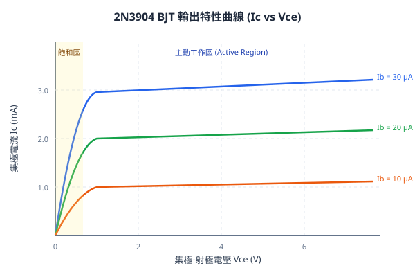

# 實驗報告：BJT 雙極性接面電晶體特性量測

- **所屬課程**：電子學實驗 (EE201)
- **實驗編號**：lab-03
- **報告模式**：shared (共同報告)
- **組員名單**：示範學生 (sample-student)
- **完成日期**：2026-09-18

---

## 一、實驗目的
1. 瞭解 NPN 型雙極性接面電晶體（2N3904）之基本結構與端點特性。
2. 透過直流偏壓量測，繪製電晶體之輸出特性曲線族（$I_C$ vs $V_{CE}$ 在不同基極電流 $I_B$ 下）。
3. 由實測特性曲線計算共射極電流增益 $\beta$（直流放大倍率），並觀察 Early 效應與飽和區交界。

---

## 二、實驗原理
BJT 在主動放大區（Active Region）中，集極電流 $I_C$ 主要受基極電流 $I_B$ 控制，其線性比例關係為：
$$I_C = \beta \cdot I_B$$

射極電流 $I_E$ 為集極與基極電流之和：
$$I_E = I_B + I_C = (1 + \beta) I_B$$

當集極-射極電壓 $V_{CE}$ 趨近於 0 時（通常 $V_{CE} < 0.3\ \text{V}$），基極-集極接面進入順向偏壓，電晶體進入**飽和區（Saturation Region）**，此時 $I_C$ 將隨 $V_{CE}$ 急遽下降。

---

## 三、實驗器材與元件
| 元件 / 設備名稱 | 型號 / 規格 | 數量 | 功用說明 |
| :--- | :--- | :---: | :--- |
| NPN 電晶體 | 2N3904 (TO-92) | 1 顆 | 被測主動元件 |
| 可變直流電源 | 0 ~ 30V 雙通道 | 1 台 | 分別提供 $V_{BB}$ 與 $V_{CC}$ |
| 數位萬用電表 | Keysight 34461A | 2 台 | 精確量測 $I_B, I_C, V_{CE}$ |
| 電阻器 | $100\ \text{k}\Omega,\ 1\ \text{k}\Omega$ | 各 1 顆 | 基極限流與集極負載 |

---

## 四、實驗數據與特性曲線
### 1. 清洗後數據彙整 (摘錄自 `processed/measurements_clean.csv`)
| $V_{CE}\ (\text{V})$ | $I_B = 10\ \mu\text{A}$ 下之 $I_C\ (\text{mA})$ | $I_B = 20\ \mu\text{A}$ 下之 $I_C\ (\text{mA})$ | $I_B = 30\ \mu\text{A}$ 下之 $I_C\ (\text{mA})$ | 工作狀態 |
| :---: | :---: | :---: | :---: | :---: |
| 0.0 | 0.00 | 0.00 | 0.00 | 飽和區 |
| 0.2 | 0.45 | 0.88 | 1.35 | 飽和臨界 |
| 0.5 | 0.98 | 1.95 | 2.92 | 主動區 |
| 1.0 | 1.02 | 2.04 | 3.06 | 主動區 |
| 2.0 | 1.05 | 2.10 | 3.15 | 主動區 |
| 4.0 | 1.08 | 2.15 | 3.22 | 主動區 |
| 6.0 | 1.10 | 2.20 | 3.30 | 主動區 |

### 2. 實測特性曲線分析
由 `analysis/plot_bjt.py` 產出之向量曲線圖如下所示：

---

## 五、問題與討論
### 1. 電流增益 $\beta$ 分析
在 $V_{CE} = 2.0\ \text{V}$ 時：
- 當 $I_B = 10\ \mu\text{A}$ 時，$\beta = \frac{1.05\ \text{mA}}{10\ \mu\text{A}} = 105$
- 當 $I_B = 20\ \mu\text{A}$ 時，$\beta = \frac{2.10\ \text{mA}}{20\ \mu\text{A}} = 105$
- 當 $I_B = 30\ \mu\text{A}$ 時，$\beta = \frac{3.15\ \text{mA}}{30\ \mu\text{A}} = 105$

數據顯示 2N3904 在常用工作電流區間具有極佳的線性放大特性，實測 $\beta$ 值穩定落在 100 ~ 110 之間，符合原廠 Datasheet 之典型規格（$\beta_{typ} \approx 100$）。

### 2. Early 效應探討
由圖表可見，在主動區曲線隨 $V_{CE}$ 增加呈現微幅向上傾斜（例如 $I_B=20\ \mu\text{A}$ 時，從 $1\ \text{V}$ 的 $2.04\ \text{mA}$ 微幅增至 $6\ \text{V}$ 的 $2.20\ \text{mA}$）。此現象源於空乏區寬度隨逆向偏壓增加而展寬，導致基極有效寬度縮小，即為典型的 Early 效應。

---

## 六、結論
本次實驗成功量測並繪製 2N3904 之輸出特性曲線，精確鑑別了飽和區（$V_{CE} < 0.3\ \text{V}$）與主動放大區。實測數據與理論模型高度吻合，驗證了 BJT 做為電流控制電流源（CCCS）之核心特性。
